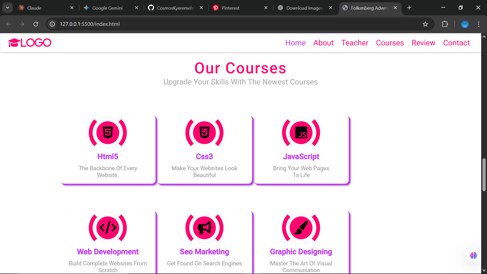

# 🎓 EduSite – Responsive School Website

EduSite is a responsive educational website designed to represent a modern online school platform.  
It features a clean UI, multiple sections, and interactive elements built with front-end technologies.

🔗 **Live Demo:** https://cosmoskyeremeh.github.io/EduSite/

---

## 📌 Table of Contents

- [Overview](#overview)
- [Features](#features)
- [Technologies](#technologies)
- [Project Structure](#project-structure)
- [Getting Started](#getting-started)
- [Screenshots](#screenshots)
- [Learning Goals](#learning-goals)
- [Credits](#credits)
- [Author](#author)

---

## 📖 Overview

This project showcases a full landing-page website for a school or online learning platform.  
It includes:

- Hero landing section
- About section
- Teachers profiles
- Courses offered
- Student reviews
- Contact form

The goal was to practice responsive design and basic front-end interactions.

---

## ✨ Features

✔ Fully responsive layout  
✔ Animated navigation bar  
✔ Clean modern UI  
✔ Interactive menu toggle  
✔ Organized sections  
✔ Font Awesome icons  

---

## 🛠️ Technologies

- **HTML5** – Structure  
- **CSS3** – Styling and responsiveness  
- **JavaScript** – Interactivity  
- **jQuery** – DOM manipulation  
- **Font Awesome** – Icons  

---

## 📂 Project Structure

EduSite/
│
├── sch.html # Main HTML file
├── sch.css # Styling
├── sch.js # JavaScript functionality
├── schImgs/ # Images folder
└── README.md # Documentation

## 📸 Screenshots

## 🎯 Learning Goals
This project helped me practice:

Building complete website layouts

Using CSS Flexbox and responsiveness

Creating interactive UI with JavaScript

Organizing project files

Hosting with GitHub Pages

## 🙌 Credits
Design inspired by Mr. Web Designer
Used strictly for learning and practice purposes.

## 👨‍💻 Author
*Cosmos Kyeremeh*

Front-End Developer

GitHub: https://github.com/CosmosKyeremeh

⭐ Feel free to star this repository if you find it helpful!